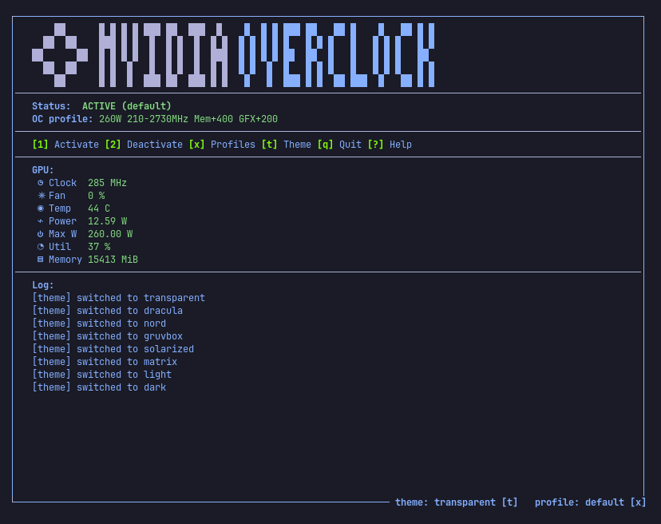

# Nvidia TUI Overclocker

A lazydocker-style terminal UI for NVIDIA GPU overclocking, with live GPU
telemetry, savable OC profiles, and a themeable interface.



## Files

| File | Purpose |
|------|---------|
| `gpu_tui.py` | The TUI (run this). Live stats, profile menu, themes, action log. |
| `apply_overclock.py` | Applies the selected OC profile (also usable standalone). |
| `reset_overclock.py` | Restores factory defaults: power limit, locked clocks, clock offsets. |

## Requirements

- Linux with an NVIDIA GPU and a recent driver (NVML)
- Python 3.10+
- `pynvml` — the only third-party dependency:
  ```
  pip install -r requirements.txt
  ```

## Usage

Run the TUI (applying OC and editing profiles need root):

```
sudo python3 gpu_tui.py
```

Without sudo the TUI runs in read-only mode: live stats, status, and profile
viewing work, but OC/profile actions are disabled.

Standalone:

```
sudo python3 apply_overclock.py              # apply the selected profile
sudo python3 apply_overclock.py <profile>    # apply a profile and select it
python3 apply_overclock.py --list            # list profiles ('*' = selected)
sudo python3 reset_overclock.py              # remove OC, restore factory defaults
```

## Keys

| Key | Action |
|-----|--------|
| `1` / `a` | Activate overclock (selected profile) |
| `2` / `d` | Deactivate overclock |
| `x` | Open the Profiles menu |
| `1-9` | Pick a profile (menu open) |
| `n` | Define + save a new profile (menu open) |
| `d` | Delete the picked profile (menu open) |
| `t` | Cycle color theme |
| `?` / `h` | Help overlay |
| `q` / `Esc` | Close menu / quit |

## Profiles

Profiles live in a single file, `~/.config/gpu-tui/profiles.json` — the same
file the OC scripts read:

```json
{
  "selected": "default",
  "default": {
    "power_w": 260,    "clock_min": 210,  "clock_max": 2730,
    "mem_off": 400,    "gfx_off": 200
  }
}
```

A theme file (`~/.config/gpu-tui/theme`) stores the last-used color theme.
While an OC is applied, the active profile name is written to
`/tmp/gpu_oc_active` (removed on reset) so other tools can detect the state.

## How the overclock works

A profile is three cooperating controls, all applied via NVML:

- **Power limit** (`power_w`) — the card's power ceiling. The GPU can never
  draw more than this, so the power management algorithm backs the clock
  off whenever the limit is hit. This is the main lever: a well-chosen
  limit gives most of the performance for far less heat than chasing
  clocks.

- **Clock range** (`clock_min` .. `clock_max`) — the GPU's graphics clock
  is locked inside this window. It cannot drop below `clock_min` (no
  downclocking under load spikes) or rise above `clock_max` (the boost
  ceiling).

- **Clock offset** (`gfx_off` / `mem_off`) — shifts the operating point
  along the chip's clock-vs-voltage curve: while running at clock *x*,
  the driver requests the voltage the curve assigns to clock *x + offset*.
  The chip therefore behaves like a slightly faster (or slower) chip at
  the same clock — extra stability headroom, or lower voltage for the
  same performance. The memory offset works the same way on the memory
  clock (the driver stores it x2 internally; the profile keeps plain MHz).

`reset_overclock.py` removes all three: power limit back to the factory
default, clock lock released, offsets to 0.

## Notes

- The scripts apply to GPU index 0. For multi-GPU setups, edit the
  `nvmlDeviceGetHandleByIndex` calls.
- `reset_overclock.py` restores a 285 W power limit as the factory default;
  adjust `FACTORY_POWER_W` if your card's default differs.
